# ⚽ SoccerClub

> 아마추어 축구 동호회를 위한 올인원 팀 관리 Android 앱

SoccerClub은 축구 동호회 활동에 필요한 주요 기능들을 하나의 앱에 담았습니다.  
팀 관리, 선수 모집, 시합 매칭, 일정·출석 관리, 전적 기록, 실시간 채팅 등 동호회 활동에 필요한 기능이 있습니다

<br>

## 📱 스크린샷

### 인증
| 로딩 | 로그인 | 프로필 생성 |
|:---:|:---:|:---:|
|  | 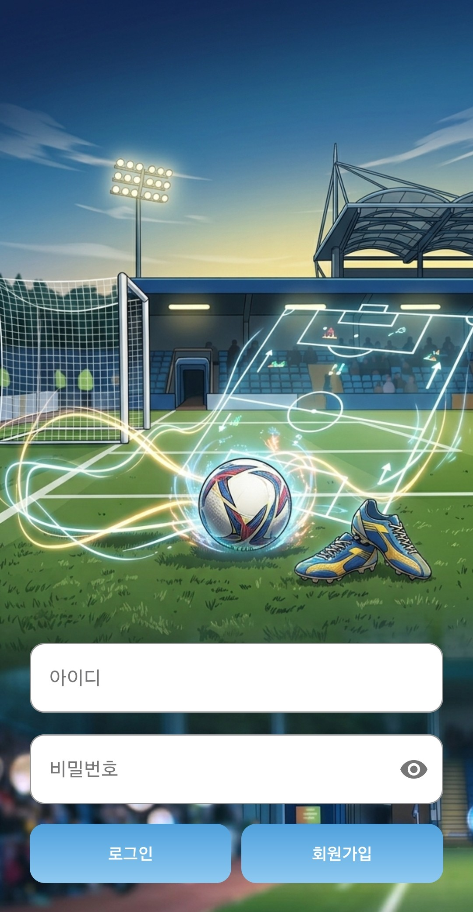 | 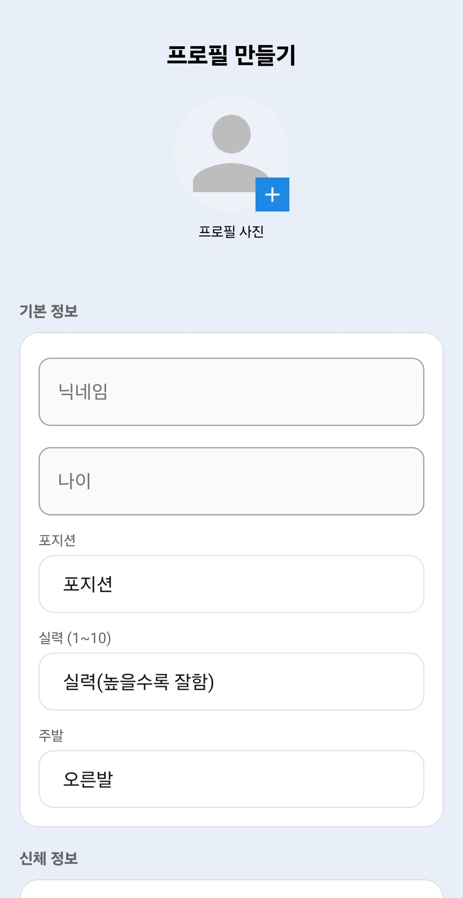 |

### 내 팀
| 팀 정보 | 일정 · 기록 · 멤버 | 멤버 상세 |
|:---:|:---:|:---:|
| 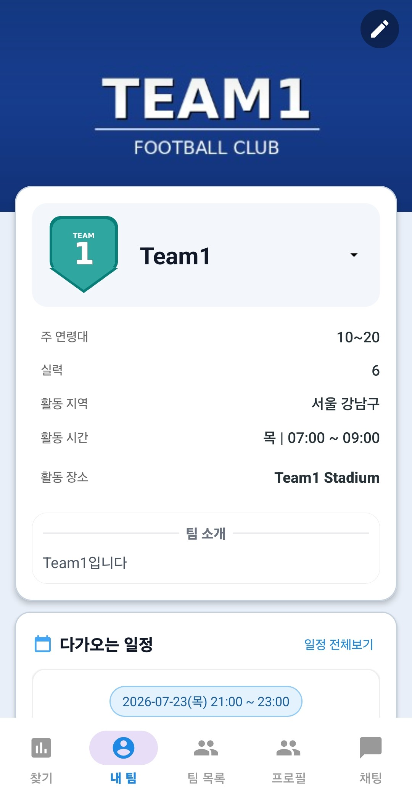 | 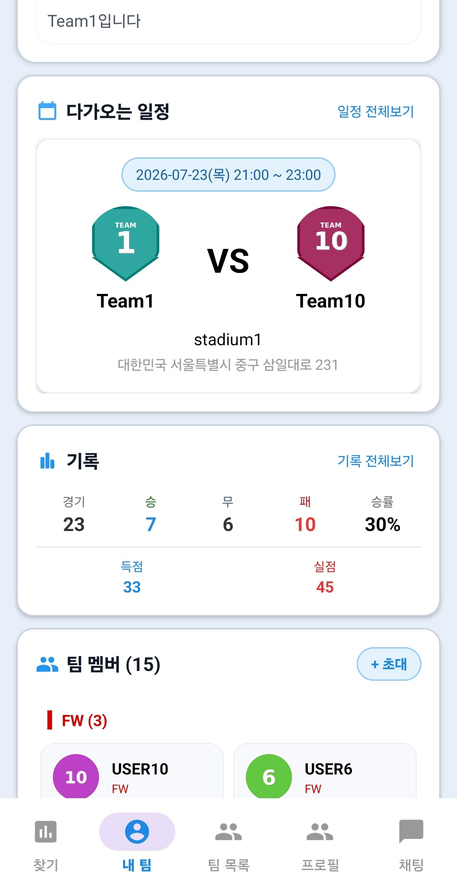 | 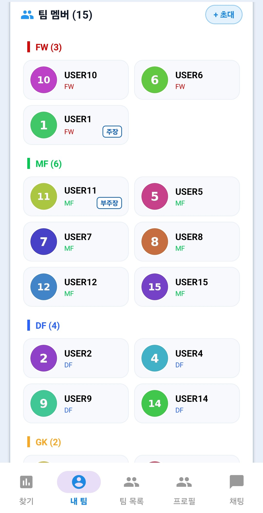 |

| 일정 (캘린더) | 일정 상세 | 출석 투표 | 팀 기록 |
|:---:|:---:|:---:|:---:|
| 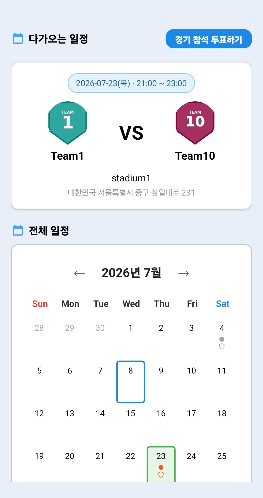 | 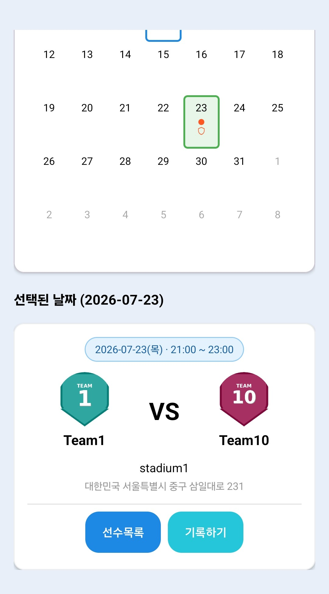 | 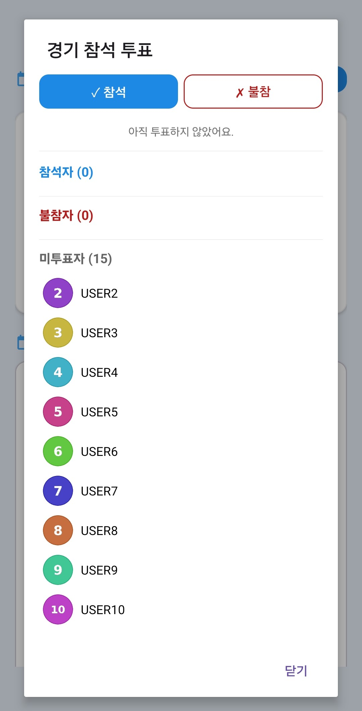 | 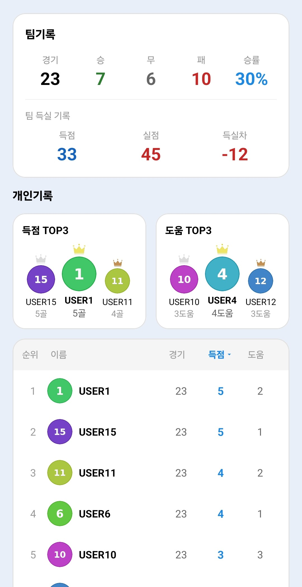 |

### 찾기 (모집 / 시합)
| 모집 목록 | 시합 목록 | 필터 | 모집글 상세 |
|:---:|:---:|:---:|:---:|
| 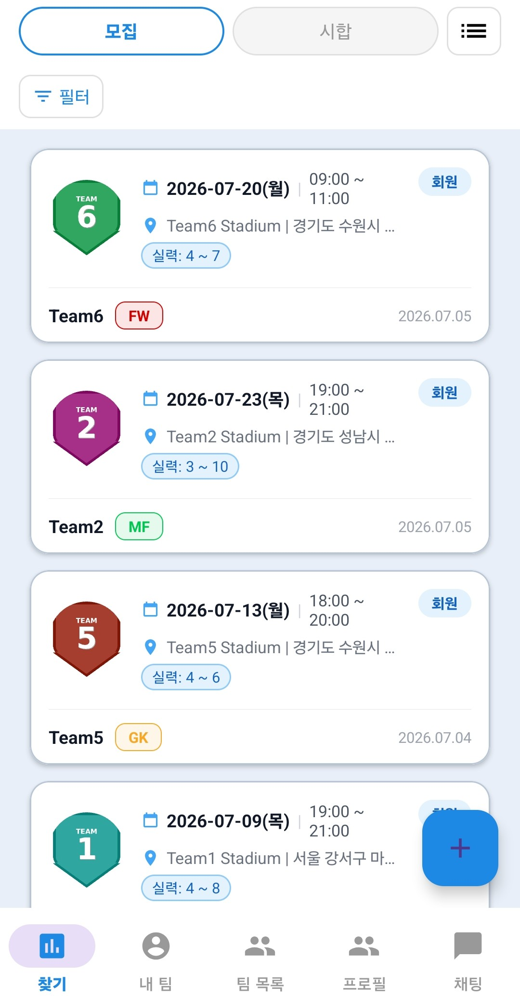 | 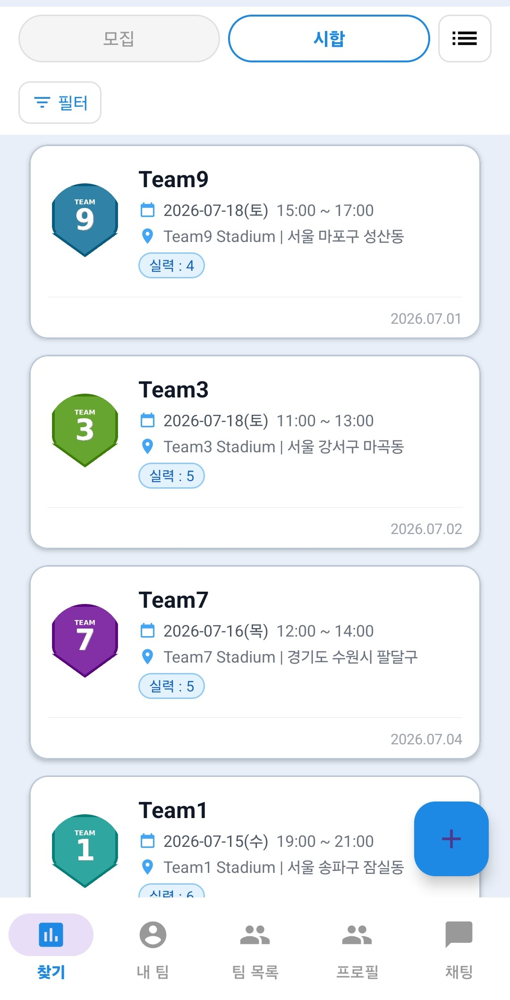 | 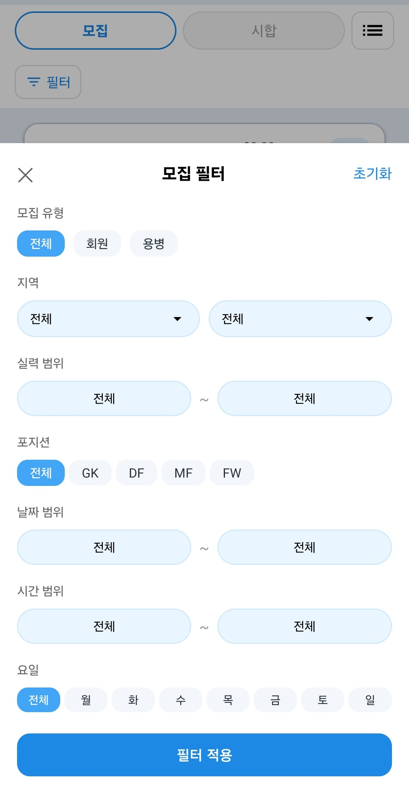 | 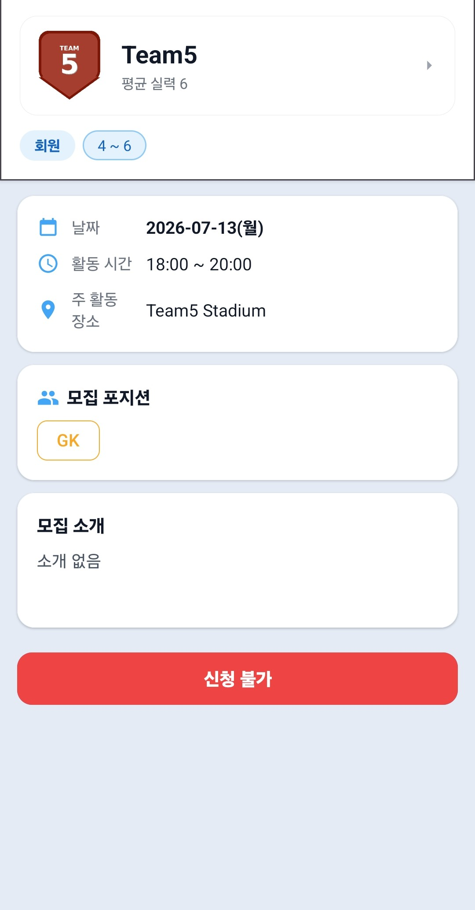 |

| 시합글 상세 | 모집글 작성 | 내가 작성한 글 | 신청한 글 |
|:---:|:---:|:---:|:---:|
| 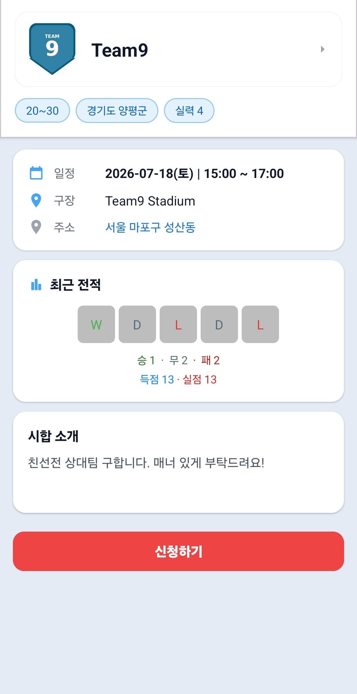 | 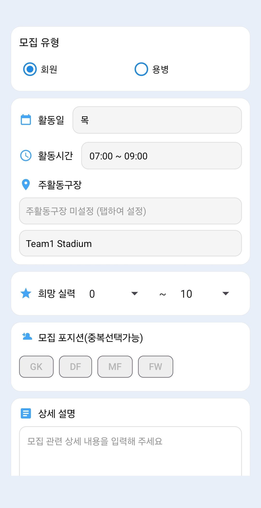 | 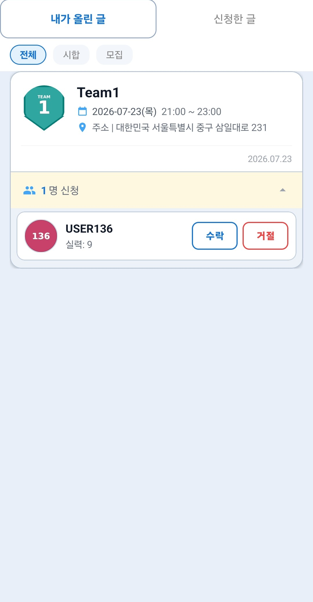 | 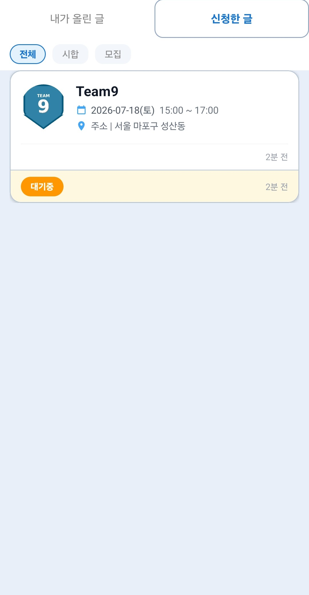 |

### 팀 목록
| 팀 목록 | 팀 만들기 |
|:---:|:---:|
| 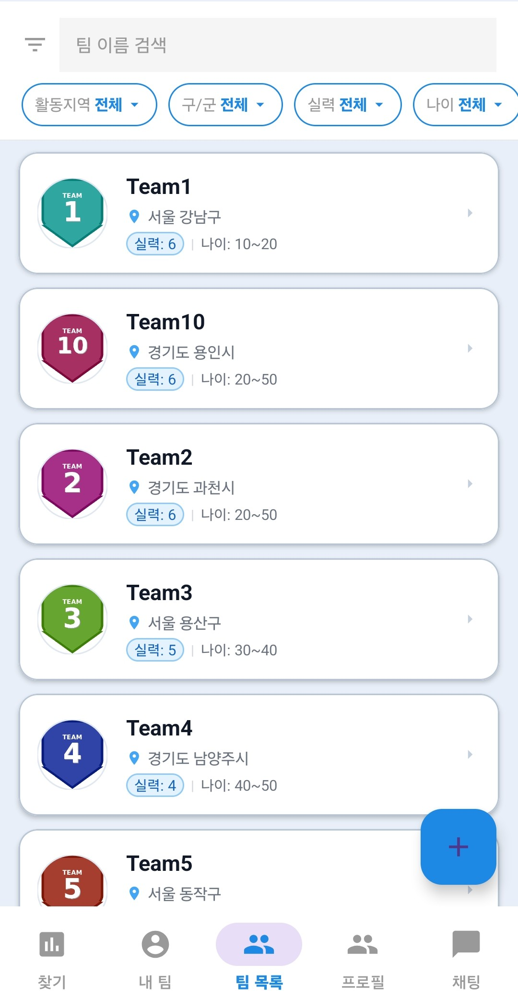 | 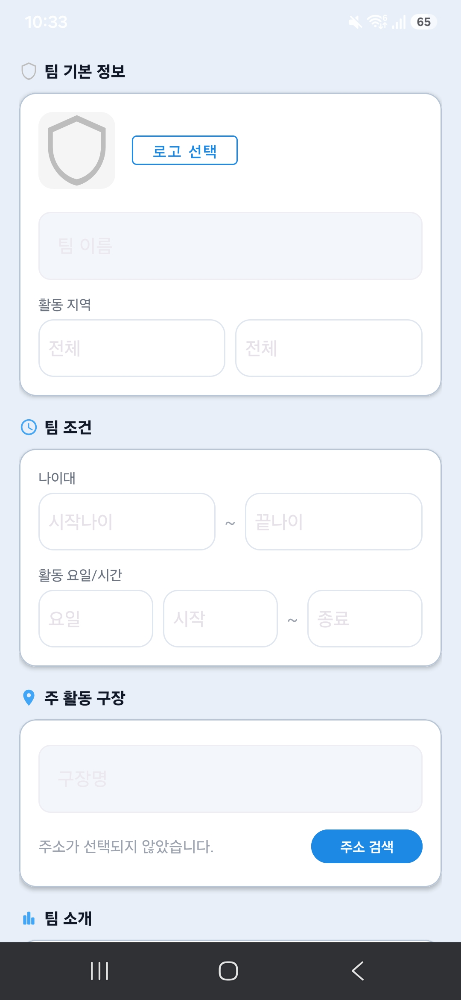 |

### 프로필
| 내 프로필 |
|:---:|
| 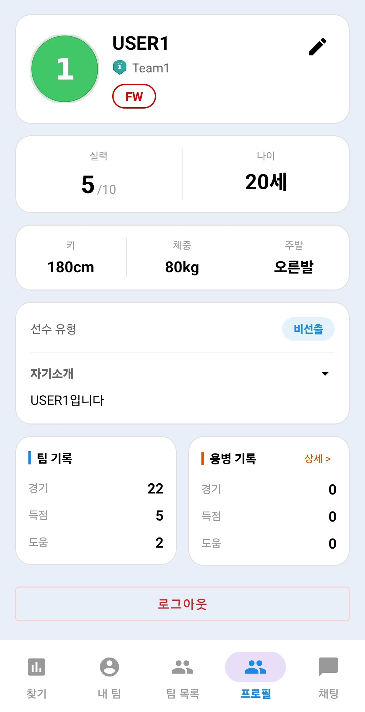 |

<br>

## 🏗️ 기술 스택

| 구분 | 기술 |
|---|---|
| **Language** | Java 11 |
| **Platform** | Android (minSdk 26 / targetSdk 35) |
| **Architecture** | Repository + ViewModel (MVVM) |
| **Backend** | Firebase Auth · Firestore · Storage |
| **지도** | Naver Maps SDK |
| **이미지** | Glide 4.16 |
| **UI** | Material Design 3, Facebook Shimmer |
| **네트워크** | OkHttp 4.12 |
| **빌드** | Gradle 8.11 (Kotlin DSL), AGP 8.9 |

<br>

## 📂 프로젝트 구조

```
com.jjw.soccerclub
├── ui/                     # 화면 (Activity / Fragment)
│   ├── auth/               #   로그인 · 회원가입 · 프로필 생성
│   ├── team/               #   내 팀 · 팀 상세 · 팀 목록
│   ├── recruit/            #   선수 모집 (회원 · 용병)
│   ├── match/              #   시합 매칭
│   ├── chat/               #   실시간 채팅
│   ├── profile/            #   내 프로필 · 용병 활동
│   └── common/             #   일정 · 기록 · 공통 베이스
├── viewmodel/              # ViewModel (UI 상태 관리)
├── repository/             # Repository (Firebase 호출 전담)
├── model/                  # 데이터 모델 (POJO)
├── adapter/                # RecyclerView 어댑터
├── common/                 # 공통 컴포넌트 (StateLayout, CustomCalendarView 등)
└── util/                   # 유틸리티 (DateUtils, GlideHelper, AppUtils 등)
```

<br>

## ✨ 주요 기능

### 🔐 인증
- 아이디 / 비밀번호 기반 회원가입 · 로그인 (Firebase Auth)
- 최초 로그인 시 프로필 생성 (닉네임, 포지션, 실력, 신체정보, 선수 유형)

### 👥 팀 관리
- 팀 생성 및 정보 편집 (사진, 활동 지역·시간·장소)
- 포지션별(FW / MF / DF / GK) 멤버 관리
- 주장 · 부주장 권한 체계
- 팀 목록 조회 및 필터링 (지역, 실력, 나이)

### 📋 선수 모집
- **회원 모집** — 팀에 정식 멤버로 합류할 선수 모집
- **용병 모집** — 특정 경기에 참여할 용병 모집
- 모집 유형 · 지역 · 실력 · 포지션 · 날짜 · 시간 · 요일 복합 필터
- 신청 → 수락/거절 워크플로우

### ⚔️ 시합 매칭
- 친선전 상대팀 모집 글 등록 (날짜, 시간, 장소, 주소 검색)
- 상대팀 최근 전적(W/D/L) 확인 후 신청
- 시합 수락 시 양팀 일정에 자동 등록 + 채팅방 개설

### 📅 일정 관리
- 월별 캘린더 뷰 — 경기 일정 도트 표시
- 다가오는 일정 카드 (VS 매치 카드, 구장·주소 정보)
- **경기 참석 투표** — 참석 / 불참 / 미투표자 실시간 확인

### 📊 기록 · 통계
- **팀 기록** — 경기 수, 승/무/패, 승률, 득점/실점/득실차
- **개인 기록** — 득점 TOP3, 도움 TOP3 시상대 UI
- 전체 선수 순위 테이블 (경기/득점/도움 정렬)

### 💬 실시간 채팅
- 1:1 채팅 (시합 매칭 수락 시 자동 생성)
- 실시간 메시지 전송 · 읽지 않은 메시지 카운트

### 👤 프로필
- 개인 정보 관리 (포지션, 실력, 키, 체중, 주발, 선수 유형)
- 팀 기록 · 용병 기록 분리 조회

<br>

## 🗄️ Firestore 데이터 구조

```
📁 users/{uid}                    # 아이디 · 이메일
📁 profiles/{uid}                 # 프로필 상세 정보
📁 teams/{teamId}                 # 팀 정보 · 멤버 배열
📁 teamStats/{teamId}             # 팀 전적 통계
📁 userStats/{uid}                # 개인 전적 통계
📁 recruitPosts/{postId}          # 선수 모집 게시글
📁 matches/{matchId}              # 시합 매칭 게시글 · 경기 결과
📁 schedules/{teamId}
│   └── 📁 events/{eventId}       # 일정 이벤트
│       └── 📁 votes/{uid}        # 참석 투표
📁 chatRooms/{roomId}
│   └── 📁 messages/{messageId}   # 채팅 메시지
```

